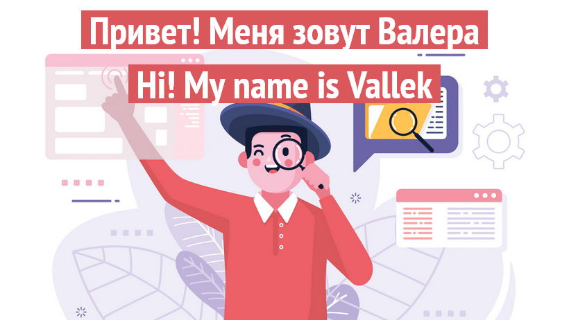

[RUSSIAN VERSION](README.md)

I work in **frontend** and **education**. I create modern, responsive web UI and care about usability, accessibility and best practices. I lean more towards front-of-the-frontend developing CSS layouts. I prefer native technologies and static site builders for my pet projects. But I'm always ready to learn other skills and tools. 

I love to share my knowledge and help others to overcome various difficulties. I create courses, live lectures and other educational materials. My projects often touch both on education and web development. I also do consulting.

I like to scrutinize things, find problems and ways to fix them.

My goal is to create user experience of high quality. In the future I'm planning to create my own web education organization. I'm also interested in everything about ui design, optimizing and planning work. 

You can learn more about me on my [💎portfolio💎](https://vallek.github.io/Portfolio/index.html).

## 🔎 I'm looking for a job
* frontend, web dev, consulting
* courses author/lead

## Languages
* Russian (native)
* English (read specs, write, sometimes speak:)

## 📈 Github Stats

## 📌 My projects
* [Animatable CSS Properties](https://vallek.github.io/animatable-css/)
* [Web Dev Tips Knowledge Base](https://vallek.github.io/webdevtips/en/)
* [Header Web Component](https://github.com/Vallek/vallek-custom-header)
* [Frontend Links](https://vallek.github.io/web-links/en/index.html)
* [Frontend Course](https://vallek.github.io/Portfolio/pages/courses/en/web.html)
* [How to search info on frontend lecture](https://vallek.github.io/Portfolio/pages/projects/en/search.html)

## 💼 Main skills

 

## 💬 Want to offer me a job or have a question?
Write me [an 📧 email](mailto:vwebdis@gmail.com) or text me on [telegram](https://t.me/webval). See you!
